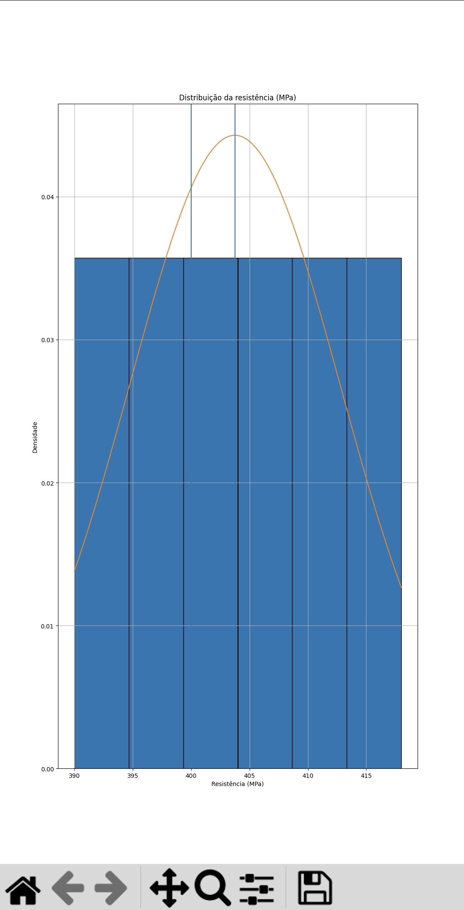

# 📊 Análise Estatística de Resistência de Material

Este projeto realiza análise estatística de ensaios de resistência mecânica utilizando Python.

## 🔧 Métodos utilizados
- Média, mediana e moda
- Desvio padrão
- Coeficiente de variação
- Pontuação Z
- Curva normal

## 📈 Gráfico Gerado

